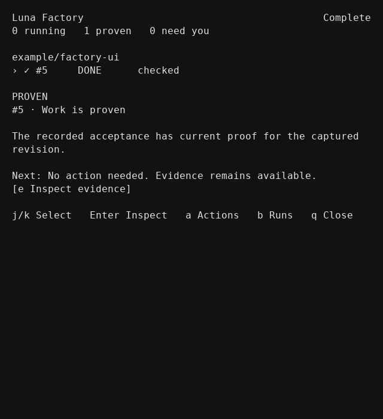
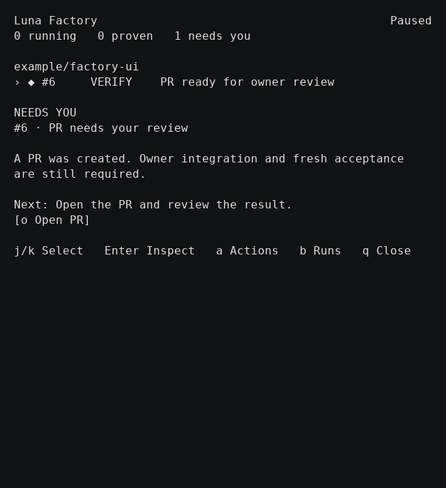
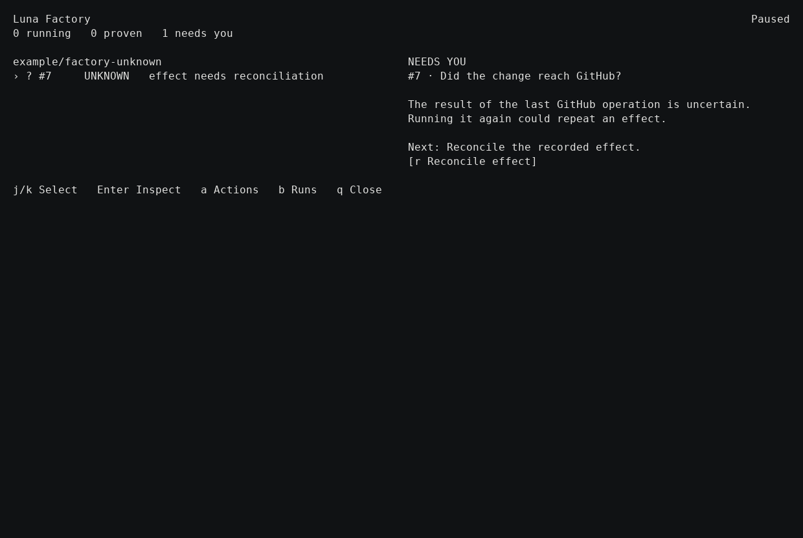

# Factory dashboard checkpoint — 2026-09-25

This records the packaged acceptance work for #128 / PR #216. Backend recovery is separately reviewable in #221; the Apptainer verification-device correction is in #222. Their commits are included in the dashboard branch so the package can be reproduced.

## Package and boundary

- Runtime source: `c61d79aa2a5f23b61b25deb3ff80650099d5541e`.
- OMP: `18.3.1`.
- SIF SHA-256: `0222df044329dec8102c738470595baa61f4f0aca5d1f7758e8683af3b6c9596`.
- Launcher SHA-256: `ad5da8cc423104b9299ad780293d0d44404d2d7f477917f24aea6e169769c210`.
- Built with `scripts/brew-dev build`, installed as the separate keg-only `review-checkpoint-validation` formula, and launched through its installed `bluefin review` command. No SIF override or manual Cellar edits.
- Normal personal Brew installation, credentials, other writers, and existing claim roots were preserved. No merge or release occurred.

GitHub and model responses came from local deterministic fixtures. OMP child sessions, Git operations against a local bare remote, verification sandbox execution, durable state, and the terminal UI were real. No production GitHub PR was created by these fixtures. Screens below are rendered from actual tmux terminal captures, not proposed designs.

## Observed results

| Journey | Result |
| --- | --- |
| Active work at 120 and 60 columns | Running work, selected item, and next action stayed visible. |
| Worker → VERIFY | The independent acceptance session appeared as active verification. |
| Pause / resume | New starts paused; an existing worker remained visible. Resume preserved selection. |
| Stop → exit → reopen → retry | Inspection #5 reached DONE on attempt 2, with its original budget intact and the real sandbox test passing. Its completed state was restored and inspected in the final package. |
| Pre-tool configuration error | Native error was bound to its exact dispatch; no tool/job was invented. Cancel/reopen recovery left the wave cancelled with zero completed items. |
| Ownership recovery in the final package | One confirmed dashboard action released both claims for the selected proved-stopped Review run. Other claim files stayed byte-for-byte unchanged; the refreshed view removed the released owner. |
| Missing terminal proof | The original reproduced unaccounted claim stayed protected. No force release was introduced. |
| UNKNOWN external effect | Reconciliation remained primary; Retry was absent. Reconciliation retained the same attempt and effect identity without replay. |
| PR-ready work | Native worker, sandbox verification, independent acceptance, local push, and the simulated GitHub response produced PR-ready proof. It remained VERIFY pending owner integration, not falsely DONE. |
| PR action | The browser adapter was invoked; the unavailable-browser link-copy fallback worked. A desktop browser launch was not qualified. |
| Evidence and worker views | Bounded views opened and returned to the parent. Worker sessions showed conversation instead of native JSON padding. |
| Completed work | Evidence stayed available; Retry, Pause, Resume, and Stop were absent from the action palette. |

The stop/retry and publication transitions were exercised during the `ee5700e` qualification run. Final retained views, ownership selection/reconciliation, worker viewer, and action guards were exercised again on `c61d79a`. Later source changes in this checkpoint are documentation only.

The full Review/Factory test gate passed on `c61d79a`, including regressions for foreign-turn proof, late tool invalidation, cancelled-state preservation, native dialogs, two-batch selection, atomic snapshot replacement, and claim inspector identity.

## Screens

### Completed inspection, 60 columns

### PR ready for owner review, 60 columns

### UNKNOWN effect, 120 columns

## Remaining qualification

This is not completion of #175's live GitHub/provider qualification. Records without positive terminal proof remain protected. Setup/profile persistence remains #151 work; #130 convergence is not a first-run prerequisite.

Dogfood also exposed a separate Factory retry defect: a failed initial clone records a workspace path that may not exist; retry then fails opening that retained path. The failed fixtures and exhausted budgets were retained rather than reset. That is the smallest proposed backend follow-up, not a reason to weaken workspace identity or ownership checks in this UI change.

The read-only issue graph audit made no issue edits, closures, comments, or consolidation changes. Cloud execution, campaigns, automatic landing, and Factory Cells remain outside this local checkpoint.
