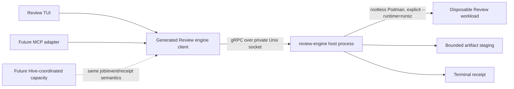

# Agent handoff: post the Review execution-engine issue

> **Fork-only posting artifact.** Do not open an upstream pull request for this file. Do not copy private Discord messages, timestamps, or quotations into the public issue.

## Posting target

- Repository: `projectbluefin/review`
- Issue title: `feat(engine): add the local execution engine for Review workloads`
- Label: `3-human-queue`
- Research snapshot of upstream `main`: `c3c05f984fb7b27cc873c4621f354fcf79cde31a`
- Draft branch base (`joshyorko/review:main`): `4c78d3a100a1b1255d0ba84c4298151c581a9dc3`
- Draft branch: `research/review-execution-engine-issue`

## Agent instructions

1. Fetch live `projectbluefin/review:main` and record the exact SHA before writing anything.
2. Search all open and closed issues and pull requests for an exact owner of the local Review client/engine execution boundary. Search by capabilities, not only names: `engine`, `execution`, `sandbox`, `runner`, `gRPC`, `job`, `cancel`, `events`, `artifacts`, and `cleanup`.
3. Treat #119, #166, #167, #188, #255, #348, and #351 as related but not duplicates for the reasons stated in the body below.
4. If an exact canonical issue has appeared since this research snapshot, **stop without creating a duplicate** and report its URL plus the concrete overlap.
5. Otherwise, create one issue in `projectbluefin/review` using the exact title and the body between `BEGIN ISSUE BODY` and `END ISSUE BODY`.
6. Apply only the existing `3-human-queue` workflow label. Do **not** add `blocked`: deterministic protocol, fake-engine, and lifecycle work can proceed before native Bluefin `runsc` acceptance.
7. Do not assign anyone, create a branch, open a pull request, update #351, or begin implementation in this posting action.
8. Do not paste or summarize the private maintainer conversation. The issue body records the durable product direction without exposing private chat.
9. Preserve the architecture and acceptance contract below. You may correct only a live-state reference that is objectively stale, and you must report every correction.
10. Return:
    - issue URL and number;
    - exact live Review `main` SHA used for the duplicate check;
    - labels applied;
    - whether any body text was changed, with an exact diff summary.

<!-- BEGIN ISSUE BODY -->

# feat(engine): add the local execution engine for Review workloads

## Classification

`HUMAN-DESIGN / IMPLEMENTATION-PARENT`

This issue defines and delivers the missing execution boundary for Review. It must land as independently reviewable slices, not one giant pull request.

## User promise

A maintainer can ask Review to run one bounded agent workload against an exact repository revision:

> Review: “Start this job with this exact source, workload, limits, and approved credential handles.”  
> Engine: “Sandbox allocated. Work started. Here are ordered events, status, and bounded output.”  
> Review: “Cancel it.”  
> Engine: “The process tree stopped, the sandbox was removed, and this terminal receipt records what happened.”

The same client contract works for one local repository without Hive. If the maintainer later needs multiple repositories, concurrent jobs, remote capacity, or unattended work, Hive may supply capacity without changing Review’s human-facing job, evidence, and cancellation semantics.

## Why this issue exists

Review already has most of the product semantics that an execution engine should consume:

- an exact-head `ReviewRequest` and bounded evidence contract;
- a backend-neutral `ReviewResult`;
- a harness registry with readiness, invocation, streaming, cancellation, provenance, and drafting capabilities;
- a logical `ReviewRun` state machine that is deliberately independent of a single process;
- immutable, human-confirmed `ActionPlan` semantics for GitHub mutations;
- a rootless Podman launcher with fail-closed gVisor/`runsc` proof, exact ownership labels, bounded signal handling, and cleanup tests.

What it does not have is one component that owns the physical execution lifecycle. Today the maintainer dashboard and individual harness adapters directly spawn and cancel subprocess groups inside the Review container, while the launcher owns the outer container. That is workable for one foreground review, but it does not provide a stable job boundary for reconnecting clients, a future MCP surface, exact-revision shadow workloads, artifacts, cancellation receipts, or a later local/remote capacity choice.

This issue fills that gap. It does not replace the harness registry, `ReviewRun`, Hive, or the human mutation gate.

## Current architecture and seam

### Existing contracts to consume, not duplicate

| Existing contract | What it already owns | What the engine must not reimplement |
|---|---|---|
| `ReviewRequest` / evidence manifest | repository, PR, exact base/head, bounded evidence identity | GitHub fact collection or exact-head interpretation |
| `ReviewResult` | normalized terminal review evidence and provenance | parsing/rendering a second result model |
| harness registry / adapters | harness selection, readiness/auth, model/effort, command semantics, result conversion | provider selection or a second harness registry |
| `ReviewRun` | logical run identity, stale-head semantics, resumable/yield states, terminal-result uniqueness | physical process/container ownership |
| `ActionPlan` | exact human-confirmed GitHub mutation | approval, issue/PR creation, queueing, or merge authority |
| launcher / #348 / merged #349 | host preflight, rootless Podman, mandatory `runsc`, no fallback, credential-before-execution ordering | a weaker runtime path or competing launcher |
| Hive contributor protocol | fleet task admission, selection, assignment, contributor coordination | a second scheduler or task queue |

### Gap

The missing owner is the physical job:

- allocate an exact-identity disposable sandbox;
- start one registered Review workload;
- emit ordered, bounded lifecycle and output events;
- cancel the complete process/container tree;
- collect bounded artifacts and verification evidence;
- clean up on success, failure, cancellation, timeout, interruption, or client loss;
- return one terminal receipt whose identity is tied to the actual source, image, runtime, executor, and cleanup outcome.

## Architectural decision

### Dagger-inspired, not Dagger-dependent

Use Dagger’s product shape as prior art:

- a small client contract rather than direct container/process manipulation from every UI;
- a session that mediates local resources, secrets, exact source resolution, and version compatibility;
- a runner/engine that owns container execution;
- a local default that can later point at alternate capacity without changing client semantics;
- client/engine version pairing and a guided bootstrap path.

Do **not** claim Dagger uses gRPC. Dagger’s documented client/session API is GraphQL. Review is borrowing the ownership and UX separation, not its wire protocol or its privileged runner implementation.

Do not embed Dagger itself as Review’s engine. Dagger’s documented runner shape is broader than this product needs and is not compatible with Review’s mandatory rootless, fail-closed `runsc` boundary. Review needs a much smaller engine whose only product is bounded agent workload execution.

### Recommended local topology



The local engine is a host process, not another privileged engine container. It alone receives the narrowly required container-execution authority. The Review UI container receives only the private engine socket and a session credential; it never receives the Podman socket, unrestricted host filesystem access, or a general shell service.

The launcher owns the engine session lifecycle:

1. resolve a compatible engine binary;
2. create a private runtime directory and Unix socket path;
3. generate a random session token;
4. start the engine in the foreground/supervised session;
5. prove engine health and compatibility;
6. start the Review client container with only the socket and token;
7. drain/cancel and clean the engine session when the Review launch ends.

A transient client disconnect does not automatically mean `CancelJob`; the client can reconnect and resume `WatchJob` from an event sequence. The supervising launcher ending the engine session does trigger bounded cancellation and cleanup of every remaining local job. No local job outlives the engine session without an explicitly designed future persistent mode.

### Implementation language

The protocol is language-neutral. The expected first implementation is:

- a small Go `review-engine` host binary for process/container ownership, gRPC, signals, deadlines, and static multi-architecture distribution;
- generated Python client bindings consumed by the existing Review domain/TUI layer.

A different implementation language requires an explicit design receipt showing equal or better single-binary distribution, signal/process-tree handling, gRPC support, and compatibility with the current image/launcher. Do not make the Textual process itself the engine server.

## Transport decision: gRPC over a Unix-domain socket

Use a versioned protobuf package such as `review.engine.v1` over a private Unix-domain socket for the local path.

Why:

- unary calls fit start/get/cancel/capabilities;
- server streaming fits ordered job events and bounded output;
- generated Go/Python types prevent TUI-specific prose from becoming the execution contract;
- deadlines, cancellation, health checking, and status codes have established semantics;
- a Unix socket avoids exposing a localhost TCP service and gives a filesystem permission boundary;
- the same domain messages can later be carried over a secured remote endpoint without changing Review’s product model.

The first implementation must not expose TCP. Remote gRPC requires a separate threat model, authenticated transport, tenant/actor scoping, and an actual Hive capacity contract. It is not smuggled into this local issue.

### Compatibility and versioning

- Use a versioned protobuf package from the first commit.
- Never reuse protobuf field numbers; reserve removed fields and names.
- `GetCapabilities` returns engine build/version, protocol major/minor, executor capabilities, supported limits, and runtime availability.
- Client and engine reject incompatible protocol majors before starting a workload.
- Minor additive capability differences degrade explicitly; no silent fallback to another executor/runtime.
- Record client version, engine version, protocol version, and executor version in every terminal receipt.
- Keep the client and engine version-bound in the repository. If the launcher bootstraps a binary, it fetches the exact compatible version, verifies a published digest/checksum, and caches it under XDG paths. It never downloads an unpinned “latest.”

### Local authentication

- Create the socket under an unpredictable `0700` session directory owned by the invoking user.
- Set the socket to the narrowest usable mode.
- Generate a random per-session token and pass it through a private file or inherited secret channel; never print it or place its value in process arguments.
- Require the token on every RPC in addition to Unix-socket permissions.
- Do not persist the token after session cleanup.
- A future remote endpoint uses mTLS or an equivalently explicit identity design; local token semantics are not claimed as remote authentication.

## Minimum service contract

The semantic contract is intentionally small. Exact protobuf names may change during the first protocol PR, but every capability below is required and no broader arbitrary-command surface is authorized.

```proto
service ReviewEngine {
  rpc GetCapabilities(GetCapabilitiesRequest) returns (GetCapabilitiesResponse);
  rpc StartJob(StartJobRequest) returns (StartJobResponse);
  rpc WatchJob(WatchJobRequest) returns (stream JobEvent);
  rpc GetJob(GetJobRequest) returns (JobSnapshot);
  rpc CancelJob(CancelJobRequest) returns (CancelJobResponse);
  rpc ListArtifacts(ListArtifactsRequest) returns (ListArtifactsResponse);
  rpc ReadArtifact(ReadArtifactRequest) returns (stream ArtifactChunk);
}
```

Cleanup is an engine invariant, not a normal client verb. A public `CleanupJob` RPC would let clients reason that cleanup is optional or transfer ownership back to the UI. The engine cleans automatically and reports the outcome. An operator-only recovery command may be added later only if real orphan evidence requires it.

### `JobSpec`

A start request must bind at minimum:

- client request ID / idempotency key;
- logical `ReviewRun` identity when this is a review;
- workload kind and registered executor ID;
- exact repository identity and immutable source revision;
- exact Review image digest or immutable image reference;
- bounded, schema-versioned input artifact/capsule descriptors;
- model/profile/effort only as selected by the existing harness contract;
- network policy;
- CPU/memory/runtime/output/artifact limits;
- credential **handles and declared purposes**, never secret values;
- expected client/engine/protocol compatibility;
- requested verification steps where the workload contract supports them.

A request must not contain:

- an arbitrary shell string;
- an unbounded environment map;
- raw credential values;
- arbitrary writable host paths;
- the Podman socket;
- GitHub mutation authority;
- Hive assignment tokens for standalone Review jobs;
- an instruction to weaken runtime, networking, cleanup, or evidence policy.

### Workload/executor boundary

The engine is not a generic remote shell. It executes registered workload types with typed validation.

The first workload is a deterministic fixture/no-op executor proving lifecycle semantics. The first real workload bridges one existing Review harness adapter without moving harness selection into the engine. The client uses the current registry to choose a harness and produces a typed executor request; the engine validates that executor/capability and owns physical execution.

No `sh -c`, shell pipeline, or arbitrary entrypoint is accepted by default. A future workload that genuinely requires a shell must define a bounded, testable executor contract rather than opening a universal command endpoint.

### Job identity and idempotency

- `StartJob` accepts a caller-generated request ID.
- Repeating the same request ID with a byte-equivalent canonical spec returns the existing job.
- Reusing it with a different spec fails with a conflict/precondition error.
- Engine job ID is immutable and distinct from the logical `ReviewRun` identity.
- One logical `ReviewRun` may have several physical attempts; every attempt is visible and separately receipted.
- Duplicate `CancelJob` calls are idempotent.
- A terminal job never emits a second terminal result.

## State and event model

Engine state describes physical execution, not review judgment:

```text
ACCEPTED -> PREPARING -> RUNNING -> STOPPING -> FINALIZING -> terminal
```

Terminal states:

- `SUCCEEDED`
- `FAILED`
- `CANCELLED`
- `TIMED_OUT`

Cleanup is an explicit sub-result on every terminal receipt:

- `COMPLETE`
- `FAILED`
- `UNVERIFIED`

A workload whose process exits successfully but whose artifacts, runtime proof, redaction, or cleanup fail is not a trustworthy success. The terminal receipt makes that failure visible and the consumer treats it as non-promotable.

`ReviewRun` continues to own logical `PENDING/RUNNING/YIELDED/WAITING_EXTERNAL/RESUMABLE/STALE/COMPLETE/FAILED/CANCELLED` semantics. The client maps engine events into that state machine. Do not merge the two enums or make an engine process ID the ReviewRun identity.

### Ordered events

Every `JobEvent` carries:

- job ID;
- monotonically increasing sequence number;
- event timestamp plus monotonic elapsed duration where applicable;
- typed event kind;
- bounded payload;
- engine/executor/source/image provenance sufficient to reject cross-job substitution.

Minimum event kinds:

- accepted/preparing/running/stopping/finalizing;
- stdout/stderr or normalized executor output chunks;
- status/progress;
- artifact declared/available/rejected;
- cancellation requested/acknowledged;
- timeout;
- runtime/security/cleanup finding;
- terminal receipt available.

`WatchJob` accepts `after_sequence` so a client can reconnect without replaying an unbounded transcript. The engine retains a bounded event window through terminal retention. If the requested cursor is too old, it returns an explicit gap plus the current `JobSnapshot`; it never pretends the stream was complete.

Raw output is bounded by bytes, lines/chunks, and retention. Truncation is a typed event and receipt field, not silent loss. Secret redaction occurs before any event, log, artifact metadata, or receipt leaves the engine.

## Cancellation and shutdown

gRPC stream cancellation is not workload cancellation.

- Closing `WatchJob` only stops that observation stream.
- `CancelJob` is the explicit workload mutation.
- `CancelJob` records the actor/session, reason, timestamp, and accepted current state.
- Cancellation targets the complete process/container tree, not one PID.
- Use bounded TERM-to-KILL escalation and exact engine ownership labels/IDs.
- After cancellation, artifacts may be returned only if the contract marks them complete and safe; partial artifacts are identified as partial or rejected.
- The terminal `CANCELLED` receipt is emitted only after cleanup completes or fails explicitly.
- Client disconnect does not orphan a job; the engine still enforces its deadline and session policy.
- Engine shutdown marks health `NOT_SERVING`, refuses new jobs, drains or cancels active jobs within a bounded deadline, removes owned resources, then exits.
- A crash/restart performs ownership-scoped reconciliation before accepting new work. Unknown/unverifiable resources are reported, never silently adopted or deleted.

## Terminal receipt and artifacts

One immutable terminal receipt binds:

- job ID and request/idempotency ID;
- logical ReviewRun identity where applicable;
- exact repository and source revision;
- immutable image identity;
- workload/executor/harness/model/effort;
- client, engine, protocol, Podman, and `runsc` versions;
- verified OCI runtime identity;
- start/end/duration and terminal state/reason;
- requested and effective limits/network policy;
- credential handle inventory by purpose, never values;
- output truncation/redaction inventory;
- verification performed/not performed;
- artifact names, types, sizes, digests, completeness, and trust class;
- cancellation/timeout details;
- cleanup result and any residue;
- provenance needed to construct or reject the existing `ReviewResult`.

Artifact transfer is pull-based and bounded:

- no arbitrary host path is returned;
- names are logical and validated;
- each artifact is size-limited, digested, and immutable once declared available;
- chunk reads are bounded and resumable;
- source trees, diffs, screenshots, logs, patches, and test reports have explicit media/trust types;
- secret-bearing or policy-rejected artifacts never become available;
- the engine deletes staging after the retention/consumption contract and records deletion.

## Security and runtime invariants

The merged #349 contract is mandatory wherever execution ownership moves.

For every engine path capable of running agent-controlled work:

1. Resolve exactly `runsc`; do not infer or accept Podman’s default runtime.
2. Require an executable/version-valid `runsc` and rootless Podman.
3. Before any workload credential is materialized or transferred, run the credential-free disposable probe and positively verify `OCIRuntime=runsc`.
4. Start every applicable workload with explicit `podman --runtime=runsc`.
5. Inspect the real workload and bind the terminal receipt to `OCIRuntime=runsc`.
6. Never fall back to `crun`, `runc`, Podman’s configured default, a host-network shortcut, or an unproved runtime.
7. Never package `runsc` inside the Review workload image as a substitute for host provisioning.
8. Preserve exact ownership labels/IDs and bounded cleanup on every path.
9. Cleanup failure, runtime mismatch, redaction failure, stale source, or unverifiable identity makes the job non-promotable.
10. Build/audit utility containers remain outside the agent-execution policy only when they cannot execute untrusted/agent-controlled work.

The engine may be version-bootstrapped by the Review launcher because it is Review-owned product code. `runsc` is different: it is the host OCI runtime and remains supplied by the supported host provisioning path. Do not make the engine installer silently install or modify `runsc`, Podman defaults, system configuration, cgroups, or networking.

### Source isolation

- Resolve mutable repository refs to exact commits before execution and record both requested and resolved identities.
- Prefer an engine-owned clone or immutable source artifact; do not mount the maintainer’s live checkout writable by default.
- A local dirty-worktree execution requires a future explicit snapshot/capsule contract; it is not inferred from a path.
- The running Review instance and its state are never mounted writable into a workload.
- A Shadow consumer must provide an exact-revision reproduction capsule, not live Review credentials or mutable state.

### Credentials

- The client passes typed credential handles, not values.
- The engine resolves only allowlisted handles already made available by the supervising launcher/session.
- Materialize a credential as late as possible, only after runtime proof and source/workload validation.
- Mount/pass only what the registered executor requires.
- Values never enter protobuf messages, argv, events, logs, artifacts, receipts, or screenshots.
- Revoke/remove staged credentials during finalization before terminal success.
- Standalone Review jobs never receive a live Hive assignment token.

## Review, engine, and Hive authority

| Owner | Owns | Explicitly does not own |
|---|---|---|
| **Review client/core** | maintainer UI, policy, source/evidence request, harness selection, logical ReviewRun, ReviewResult, Shadow policy later, ActionPlan preview/confirmation | physical sandbox lifecycle, Hive task assignment |
| **Review engine** | local physical job allocation, exact workload execution, ordered events, cancellation, artifacts, runtime proof, terminal receipt, cleanup | task planning/ranking, GitHub mutation, maintainer verdict, harness choice, Hive admission |
| **Hive** | fleet-scale selection, assignment, contributor coordination, remote capacity policy, unattended work | standalone maintainer review decisions, local Review UI, GitHub human authority |
| **Human maintainer** | whether to review, cancel, discard, file, prepare a draft PR, approve, queue, or merge | none of these decisions are delegated merely by starting a job |

The local engine is useful with no Hive deployment. A future Hive capacity adapter may implement the same job/event/receipt semantics for work Hive admits and assigns, but it must not make Review a second scheduler or allow Review to bypass Hive admission.

## Relationship to existing work

- Parent product: #173
- Maintainer harness registry/capabilities: #166
- Hive worker backend selection: #167 — separate
- Goose ACP/Hive task transport: #119 — separate
- Exact-head request/evidence: #183 / PR #190
- Human-confirmed GitHub mutation: #184 / PR #191
- Exact-head re-review: #185 / merged PR #350
- Future MCP client: #188
- ReviewRun logical lifecycle: #255 / merged PR #347
- Runtime restoration baseline: #346
- Mandatory isolation: #348 / merged PR #349
- Factory presentation: #314 — read-only consumer, not engine authority
- Shadow Mode consumer: #351
- Bluefin host `runsc` provisioning and native acceptance:
  - projectbluefin/bluefin#1139
  - projectbluefin/bluefin#1142

After this issue is accepted, #351 should replace “waiting for Jorge’s unpublished engine” with this canonical dependency. #351 remains the owner of observer/repair policy and the Improvement Inbox; it must not implement a competing execution backend.

## Delivery slices

Each slice must be independently reviewable, testable, and revertible.

### Slice A — protocol/domain contract and deterministic engine

- add the versioned protobuf contract;
- add generated Go/Python bindings and drift check;
- implement an in-process or loopback deterministic fixture engine behind the real client contract;
- prove capabilities, start/watch/get/cancel, idempotency, event sequencing, terminal receipt, cleanup state, deadlines, health, and incompatible-version behavior;
- no Podman, provider credentials, or live GitHub required.

**Checkpoint:** one deterministic no-op job completes and one blocking fixture is cancelled with ordered events and a cleanup-complete receipt.

### Slice B — version-bound launcher/bootstrap

- add the host engine binary build/release path for amd64 and arm64;
- bind the generated client to the compatible engine/protocol version;
- implement exact-version resolution, digest verification, XDG cache/runtime paths, private socket/session token, health check, supervised startup, bounded shutdown, and cleanup;
- do not expose TCP or install `runsc`.

**Checkpoint:** a clean host fixture starts a compatible engine automatically; tampered digest, incompatible version, unsafe path/permissions, startup timeout, and engine crash all fail closed without launching a Review workload.

### Slice C — real rootless Podman/`runsc` executor

- implement one registered fixture executor using the existing Review image;
- preserve the exact #349 probe and pre-credential ordering;
- use immutable source/image identities, exact labels, resource limits, network policy, cancellation, and cleanup;
- inspect the real workload runtime and include it in the receipt.

**Checkpoint:** deterministic fakes pass in CI; native Bluefin acceptance proves the real workload under `runsc`. Native unavailability remains explicit rather than forged.

### Slice D — harness execution bridge

- bridge one existing maintainer harness through the engine without moving selection/readiness/result conversion out of #166;
- map engine events to the current UI and engine terminal evidence to the existing ReviewResult/ReviewRun contracts;
- preserve same-head/stale-head behavior and exact cancellation.

**Checkpoint:** the same fixture review produces equivalent normalized result semantics through the old direct adapter and new engine path; the engine path becomes authoritative only after parity and cleanup evidence.

### Slice E — artifacts, verification, reconnect, and reliability

- bounded artifact manifests/chunking/digests;
- reconnect from `after_sequence`;
- event-gap behavior;
- engine restart ownership reconciliation;
- deadline/timeout handling;
- redaction and secret corpus;
- cleanup-failure and residue receipts;
- metrics/traces correlated by job/ReviewRun without putting sensitive data in OTel baggage.

**Checkpoint:** fault-injection matrix is green, including client loss, engine interruption, container refusal, hung process tree, artifact truncation, and cleanup failure.

### Slice F — consumers

- #351 Shadow Repair Loop consumes the engine only after the minimum real local executor is accepted;
- #188 MCP/App may expose start/get/watch/cancel as a thin adapter over the same Review operation/client service;
- neither consumer creates a second execution backend or raw command API.

### Slice G — optional Hive-backed capacity

- only after Hive exposes a concrete accepted capacity/execution contract;
- Review submits or observes work through a Hive-owned adapter while Hive retains admission/assignment;
- local and Hive-backed receipts preserve the same semantic fields and human authority.

No speculative Hive API is defined in the earlier slices.

## First vertical acceptance

The first product vertical is deliberately small:

```text
Review client
  -> StartJob(exact fixture source/image + registered no-op executor)
  -> engine proves compatible runtime policy
  -> engine allocates disposable owned sandbox
  -> ordered accepted/preparing/running/output/finalizing events
  -> terminal receipt with exact identities
  -> sandbox and staged inputs removed
```

Cancellation vertical:

```text
Review client
  -> StartJob(blocking fixture)
  -> WatchJob receives running
  -> CancelJob(reason)
  -> engine stops full process/container tree
  -> cleanup completes
  -> terminal CANCELLED receipt
  -> reconnecting WatchJob observes the same terminal fact once
```

Fail-closed vertical:

```text
runsc missing, unusable, rejected, or misreported
  -> no workload credential materialized
  -> no agent-capable job starts under another runtime
  -> typed failure/receipt identifies the failed proof
  -> no residue
```

## Acceptance criteria

### API and compatibility

- [ ] One versioned protobuf package defines the complete first-slice API.
- [ ] Generated Go/Python bindings are reproducible and checked for drift.
- [ ] Compatible client/engine pairs start; incompatible majors fail before job allocation.
- [ ] Capabilities advertise executor/runtime/features honestly; missing capability never silently falls back.
- [ ] Start/cancel are idempotent and duplicate commands do not duplicate terminal facts or external effects.
- [ ] No arbitrary shell, raw Podman, filesystem path, GitHub API, or credential-value field exists.

### Execution and lifecycle

- [ ] Engine owns allocation, process/container tree, events, artifacts, terminal receipt, and cleanup.
- [ ] ReviewRun remains logical identity and stale-head authority.
- [ ] Events are ordered, bounded, reconnectable, and explicit about gaps/truncation.
- [ ] Stream cancellation is distinct from `CancelJob`.
- [ ] Cancellation, deadline, client loss, engine shutdown, and crash/restart have deterministic behavior.
- [ ] Terminal state is emitted at most once and only after cleanup is known.
- [ ] Unknown/unowned resources are never adopted or deleted by name alone.

### Security

- [ ] Every agent-capable local executor positively proves and explicitly selects `runsc` before credentials/work.
- [ ] Real workload inspection proves `OCIRuntime=runsc` and is bound into the receipt.
- [ ] There is no `crun`/`runc`/default-runtime or host-network fallback.
- [ ] Review client never receives the Podman socket or arbitrary host filesystem access.
- [ ] Secret values never enter RPC payloads, argv, events, logs, artifacts, receipts, traces, or screenshots.
- [ ] Socket/token paths resist symlinks, foreign ownership, unsafe permissions, and stale-session adoption.
- [ ] Source/image/executor substitution, stale exact head, redaction failure, and cleanup failure fail closed.

### Product boundaries

- [ ] Standalone one-repository Review works without Hive.
- [ ] Hive remains the only fleet task selection/assignment authority.
- [ ] The engine does not choose harnesses, plan work, rank tasks, mutate GitHub, approve, queue, or merge.
- [ ] #119 ACP transport and #167 worker backend selection are not duplicated.
- [ ] #188 and #351 consume the engine through the client contract rather than adding executors.
- [ ] No hidden persistent daemon, second queue, Kubernetes requirement, or provider credential database appears.

### Verification

- [ ] No-network protocol/unit tests cover every state, error, idempotency, compatibility, and bound.
- [ ] Fake runtime tests cover missing/unusable/mismatched runsc, Podman rejection, stopped/false-identity workloads, cancellation, timeout, client loss, cleanup failure, and residue detection.
- [ ] Process-tree tests prove descendants terminate.
- [ ] Artifact tests cover traversal, symlink, type, size, digest, truncation, partial, redaction, and retention behavior.
- [ ] Real Textual Pilot proves start/progress/cancel/reconnect/terminal rendering when the first UI bridge lands.
- [ ] Exact pushed heads receive required hosted checks and one fresh independent protocol/security review.
- [ ] Native Bluefin proof records architecture, OS/image identity, kernel, Podman, engine, Review image, and runsc versions; one architecture is not evidence for the other.

## Failure matrix

| Condition | Required result |
|---|---|
| engine binary missing | exact compatible bootstrap or actionable fail; never fallback to direct unsafe execution |
| binary digest mismatch | refuse before execution and remove untrusted staging |
| client/engine incompatible | fail before job allocation |
| socket path symlink/foreign owner/unsafe mode | refuse and do not overwrite/adopt |
| duplicate request ID, same spec | return existing job |
| duplicate request ID, different spec | conflict/precondition failure |
| runsc missing/unusable/mismatched | no credential/workload; typed fail-closed result |
| Podman rejects workload | failed receipt; owned residue removed |
| source/image identity changes | reject or start a new job; never silently substitute |
| client watch disconnects | job continues within policy; reconnect by sequence |
| explicit cancel | complete tree stops; cleanup then one CANCELLED receipt |
| deadline expires | bounded termination; TIMED_OUT receipt after cleanup |
| engine receives TERM | NOT_SERVING, bounded drain/cancel, cleanup, exit |
| engine crashes | restart reconciles only provably owned resources before serving |
| event window gap | explicit gap + snapshot; never imply complete replay |
| artifact too large/unsafe/digest mismatch | reject or mark incomplete; never expose unsafe artifact |
| cleanup fails | terminal receipt says cleanup failed; result non-promotable |

## Likely implementation seams

Expected new areas, exact names chosen in Slice A after inspecting current tree:

- `engine/proto/review/engine/v1/*.proto`
- `engine/cmd/review-engine/`
- small engine domain/runtime packages under `engine/`
- generated Python client package consumed from `image/`
- protocol, fixture-engine, lifecycle, security, artifact, and compatibility tests

Existing files likely touched incrementally:

- `justfile`
- `image/entrypoint.sh`
- `image/Containerfile` only for client/runtime integration that actually belongs in the image
- `image/harness/registry.py` and one adapter in the bridge slice
- `image/tui/review_run.py`
- `image/tui/review_evidence_manifest.py`
- `image/tui/review_result.py`
- `image/tui/bluefin_review_tui.py` only when the UI bridge lands
- `.github/workflows/validate.yml` and publication workflow for generated-code/engine binaries
- `AGENTS.md`
- `docs/factory/agentic-model.md`
- `docs/SKILL.md`
- closest launcher/runtime/dashboard skill documents
- `README.md`

Do not create all of these in one pull request merely because this issue lists them.

## Non-goals

- Implement Shadow Observer, Improvement Inbox, automatic repair policy, or #351 in the engine PRs.
- Replace Hive planning, convergence, admission, scheduling, assignment, contributor protocol, or backend policy.
- Replace #166’s harness registry or #255’s ReviewRun.
- Replace #119’s Goose ACP design.
- Add arbitrary command execution, a general remote shell, raw Podman/OCI APIs, or a host filesystem browser.
- Give the Review client the Podman socket.
- Hot-patch the running Review session.
- Run Dagger or another privileged engine under the name of this contract.
- Require Kubernetes, a system-wide daemon, a second Review image, or a new scheduler.
- Make remote execution, multi-tenant hosting, or Hive capacity part of the first local vertical.
- Allow autonomous issue/branch/PR creation, approval, queueing, merge, deployment, or release.
- Treat green process exit, generated patch, or cleanup-incomplete output as a trustworthy result.
- Claim native runsc acceptance from fakes, QEMU, a missing runtime, or an unpublished Bluefin image.

## Native acceptance boundary

Protocol/domain, deterministic engine, generated clients, event sequencing, idempotency, fake runtime, failure handling, and most security tests can land without a native `runsc` host.

The real Podman executor cannot claim native completion until the supported Bluefin host path is available and exercised. Track that relationship through projectbluefin/bluefin#1139 and PR #1142. A temporary Bluefin Testing Images outage may delay publication, but it does not make this issue globally blocked or authorize a manual weaker-runtime workaround.

After a capable testing image exists, native acceptance must exercise the supported installation path and then prove the real engine workload, not only a disposable standalone probe:

- `runsc --version`;
- rootless Podman;
- engine preflight and real workload `OCIRuntime=runsc`;
- ordinary permitted networking rather than host networking;
- exact source/image/executor identity;
- credential ordering and absence from evidence;
- harness readiness and bounded output;
- explicit cancellation and process-tree teardown;
- client disconnect/reconnect;
- engine shutdown/restart reconciliation;
- artifact retrieval and cleanup;
- zero unexpected containers, processes, sockets, credentials, or staging residue.

Keep #348 open until the full native product path is proven and its issue state is reconciled. Do not conflate the Bluefin image build pipeline with this Review execution engine.

## Primary design evidence

- Current Review contracts:
  - https://github.com/projectbluefin/review/blob/main/justfile
  - https://github.com/projectbluefin/review/blob/main/image/entrypoint.sh
  - https://github.com/projectbluefin/review/tree/main/image/harness
  - https://github.com/projectbluefin/review/blob/main/image/tui/review_run.py
  - https://github.com/projectbluefin/review/blob/main/image/tui/review_evidence_manifest.py
  - https://github.com/projectbluefin/review/blob/main/image/tui/review_result.py
  - https://github.com/projectbluefin/review/blob/main/image/tui/action_plan.py
  - https://github.com/projectbluefin/review/blob/main/docs/factory/agentic-model.md
- Related issues:
  - #119, #166, #167, #173, #188, #255, #314, #346, #348, #351
- Dagger client/session/runner and version-pairing prior art:
  - https://github.com/dagger/dagger/blob/main/core/docs/d7yxc-operator_manual.md
  - https://docs.dagger.io/api/clients/
- gRPC:
  - https://grpc.io/docs/what-is-grpc/core-concepts/
  - https://grpc.io/docs/guides/deadlines/
  - https://grpc.io/docs/guides/cancellation/
  - https://grpc.io/docs/guides/health-checking/
  - https://grpc.io/docs/guides/graceful-shutdown/
  - https://grpc.io/docs/guides/status-codes/
- Protobuf evolution:
  - https://protobuf.dev/best-practices/dos-donts/
- Observability:
  - https://opentelemetry.io/docs/concepts/context-propagation/
  - https://opentelemetry.io/docs/concepts/signals/traces/

## Classification after acceptance

`SAFE-FOR-AGENT in independently reviewable child slices; consequential protocol/runtime/security slices require fresh independent exact-head review`

<!-- END ISSUE BODY -->

## Research provenance — do not post this section

### Source-derived current-state facts

- The shipped `justfile` owns host preflight, Review-container lifecycle, and a fail-closed rootless Podman probe that positively verifies `OCIRuntime=runsc`; both agent-capable launch modes explicitly select `--runtime=runsc`.
- `GooseHarness` and `CodexHarness` currently own their subprocess groups, line streaming, conversion, and cancellation.
- `ReviewRun` is already the logical exact-head lifecycle and explicitly does **not** own the process.
- `ReviewRequest`, `ReviewResult`, and `ActionPlan` already bind exact source/head evidence and human mutation authority.
- Hive owns contributor task selection, assignment, prompt delivery, and contributor coordination.
- #119 is Hive-to-Goose ACP transport, #166 is maintainer harness selection, #167 is Hive worker backend selection, #188 is a thin MCP consumer, #255 is logical re-entry, #348/#349 are the outer isolation contract, and #351 is the Shadow Mode consumer.

### Direct maintainer handoff distilled without quoting private chat

- The intended product shape is Dagger-inspired client/engine separation.
- Review and the engine are both controlled by the project.
- The local client starts a bounded job; the engine allocates the sandbox, executes, streams status/events, cancels, cleans up, and returns evidence.
- gRPC was part of the intended direction.
- Standalone one-repository use must make sense without Hive; Hive is the later scale/capacity path.
- Ownership of shaping and implementing this missing issue has been handed to Josh.

### Research decisions and inferences

- Copy Dagger’s **ownership, session, version-pairing, and local/alternate-runner UX**, not Dagger’s GraphQL protocol or privileged engine implementation.
- Use a versioned gRPC API over a private Unix-domain socket for the local path. This avoids an exposed localhost service, supports generated clients and server streams, and keeps remote transport a later explicit security decision.
- Prefer a small Go host engine with a generated Python client because physical process/container lifecycle is a host concern and Review’s current UI/domain layer is Python.
- Keep the Review client container away from the Podman socket. Only the engine process receives container authority.
- Use credential handles, exact identities, and bounded artifacts; never serialize secret values or arbitrary host paths into protobuf messages.
- Native Bluefin `runsc` availability gates the real executor’s native acceptance, not the protocol/domain/fake-engine slices.

### Rejected shapes

- **Use Dagger itself as the engine:** its documented runner shape is privileged/non-rootless and conflicts with Review’s mandatory rootless `runsc` boundary; it is also much broader than Review needs.
- **Mount the Podman socket into the Review UI container:** collapses the trust boundary and gives the UI broad host execution authority.
- **Make the TUI process the server:** preserves the current process-lifetime coupling and does not create a reusable client/engine contract.
- **Expose TCP by default:** unnecessary local attack surface; Unix socket permissions plus a session token are narrower.
- **Accept arbitrary shell strings:** turns the engine into a remote shell rather than a registered workload executor.
- **Make Hive the local engine prerequisite:** violates the local-first adoption path and duplicates/entangles Hive authority.
- **Implement Shadow Mode inside this issue:** #351 is a consumer and must not become the execution backend.
